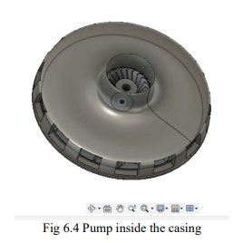
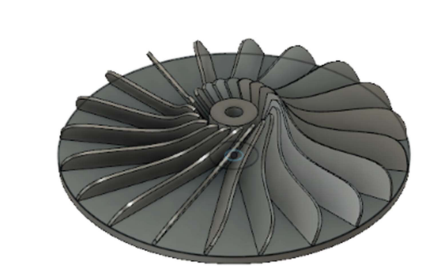
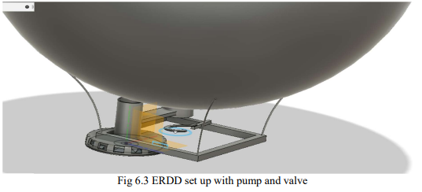

# Emergency Aerostat-Recovery-System
## *Airship* ~ *Arduino*

Aerostats are stationary airships. There are instances where the aerostats are accidently detached from the ground.
An emergency rapid deflation device has been designed to safely bring down aerostats before reaching a ceiling height of 15m above ground.

The design works with an actuating valve and a low-pressure high-volume flow rate impeller.
The mechanism of the System was as follows: a load cell is attached to the base of
the aerostat which is connected to the tether. The valve and impeller is placed
above the load cell. When the tether is cut, the aerostat lifts off, the load cell
detects tension loss and actuates the impeller.

Further pressure readings give the real time vertical ascent rate and altitude, which is used to control the impeller speed. The valve deflates helium using the impeller while inflating atmospheric air, thus bringing down the aerostat before reaching an altitude of 15m.
The deflation device has both Automatic and Manual modes for actuation. 

*Primary Components: Aerostat, Impeller, Valve, Arduino, Load cell, HX711 Module, BMP280 , Battery*

